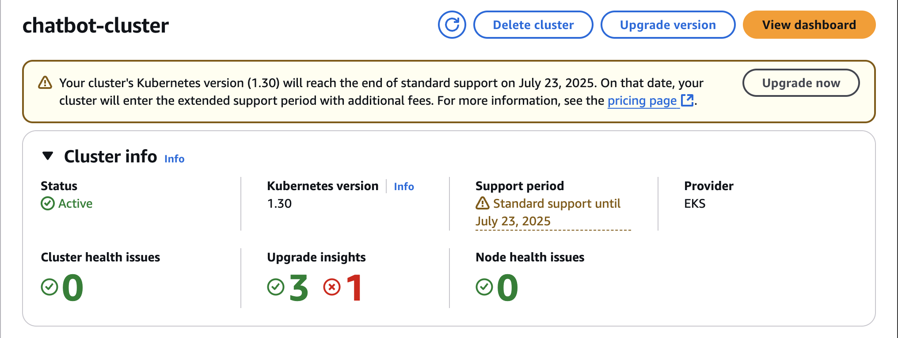

# 🏗️ 1. EKS Cluster & Node Group Setup (Manual)

## ✅ What I Did
- Created EKS cluster using AWS Console
- Selected version 1.30
- Created node group using `t3.medium`

## 📸 Screenshots
- ✅ Cluster in "Active" status 

- ✅ Node group in "Active" status 
 

## 💡 Notes
- Had issues with node group failing due to wrong AMI type
- Fixed by switching to AL2_x86_64
