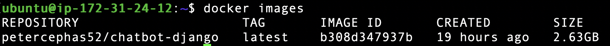

# 🐳 2. Docker Image Build & Push

## ✅ What I Did
- Built Docker image from `Dockerfile`
- Tagged and pushed it to DockerHub

## 📸 Screenshots
- ✅ `docker images` showing chatbot-django

- ✅ DockerHub page showing image uploaded

## 💡 Notes
- Remember to clean up unused Docker images regularly to save space
