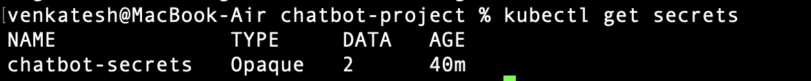
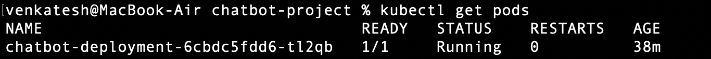
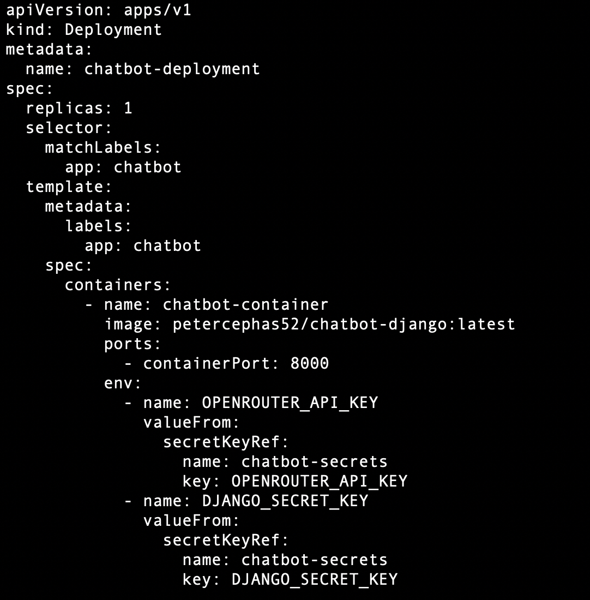

# 🔐 3. Kubernetes Secrets & Deployment

## ✅ What I Did
- Created a Kubernetes Secret for API key and Django secret key
- Created `deployment.yaml` to deploy chatbot container
- Used env vars from secret in deployment

## 📸 Screenshots
- ✅ `kubectl get secrets`

- ✅ `kubectl get pods` showing app running

- ✅ `deployment.yaml` code

## 💡 Notes
- Used `kubectl create secret generic ...`
- Verified secret injection by checking container logs
