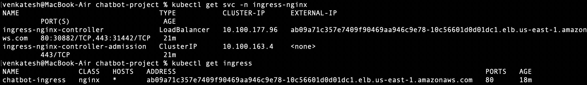

# 🌍 4. Kubernetes Service & Ingress Setup

## ✅ What I Did
- Created LoadBalancer service (initial)
- Replaced it with ClusterIP + NGINX Ingress
- Deployed ingress controller
- Created `ingress.yaml` to route `/` to chatbot

## 📸 Screenshots
- ✅ Ingress controller EXTERNAL-IP and `kubectl get ingress`

- ✅ Chatbot app working via Ingress URL

## 💡 Notes
- Learned how Ingress routes traffic
- Discovered that LoadBalancer is $$$ compared to Ingress with multiple services
