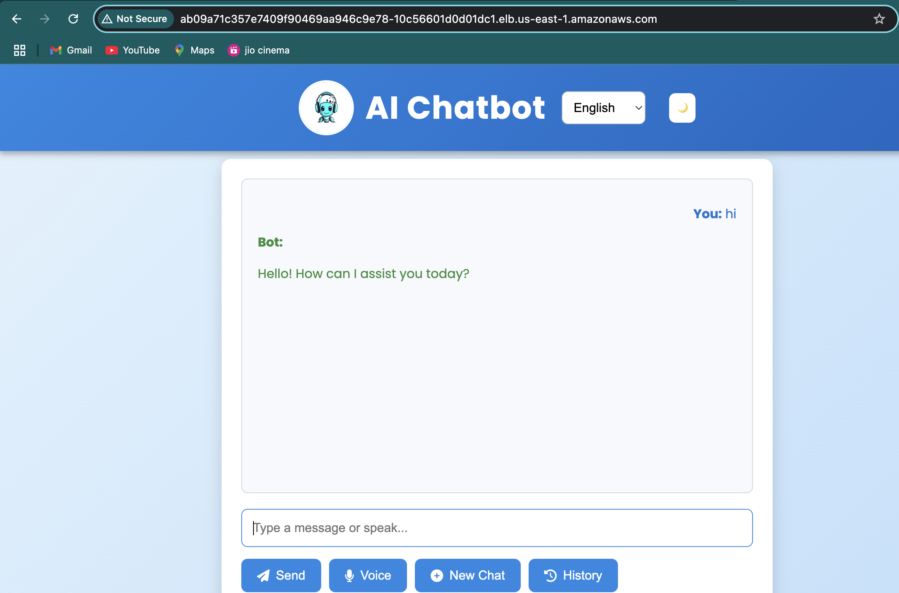

# 🧪 5. Testing, Debugging & Clean-Up

## ✅ What I Did
- Used `kubectl logs` and `kubectl describe` to debug
- Verified pods were running correctly
- Deleted all K8s and AWS resources

## 📸 Screenshots
- ✅ Final working app

## 💡 Notes
- EC2 had network issues talking to EKS — fixed by switching to local
- Documented teardown process to avoid AWS billing
